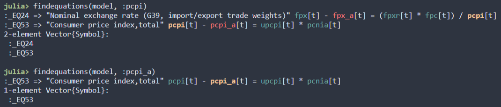

# Equation Changing Syntax

This document covers the syntax for making modifications to an existing model held in memory.

## A simple example
Given an existing model, `m1`, the following example creates a copy of the model with the addition/modification of the equation labeled `:technology`.

```julia
m2 = deepcopy(m1)
@equations m2 begin
    :technology => log(A[t]) = λ * log(A[t-1]) + ea[t] + ea[t+1]
end
@reinitialize(m2)
sssolve!(m2; method=:auto)
check_sstate(m2)
```

The above example follows these four steps.
1. Make a copy of the model using `deepcopy`.
2. Make changes to the model as required. This can be done in a series of `@variables`, `@logvariables`, `@neglogvariables`, `@steadystatevariables`, `@exogenous`, `@shocks`, `@autoexogenize`, `@steadystate`, and `@equations` blocks.
   1. Note that new `@steadystate` criteria must be added after the call to `@reinitialize`.
3. Reinitialize the model with `@reinitialize`. Changes to an initialized model must always be completed with a call to `@reinitialize`.
4. Solve the steadystate of the model with `sssolve!`.

## Removing model properties
`@delete` can be used inside any of the model construction macros to remove an existing variable/equation/etc. When removing equations and steadystate equations, the equation key must be used (without the `:`). When removing autoexogenize pairs, the entire pair must be defined with an implication arrow (`=>`).

Example:
```julia
@equations m begin
    @delete _EQ188 _EQ189
end
@variables m @delete c
@shocks m begin
    @delete c_shk
end
@autoexogenize m begin
    @delete A => ea
end
```

The `@delete` macro works at the level of the line within a block. This means that new variables can be defined in the same `@variables` block as the one which removes variables. 

Example:
```julia
@variables model begin
    @delete c
    d; e; f
end
```

## Defining equations with keys
The arrow implication, `=>` is used within the equations block to define a named key for the given equation. The key is optional. For example, the block below contains both named and unnamed equations. 

```julia
@equations model begin
    @log 1/(C[t]) = β * (1 / (C[t+1]*(1+g))) * (r[t+1]+1-δ)
    @log (L[t])^γ = w[t] / C[t]
    :rates => @log r[t] = α * A[t] * (K[t-1]/(1+g)) ^ (α-1) * (L[t]) ^ (1-α)
    :wages => @log w[t] = (1-α) * A[t] * (K[t-1]/(1+g)) ^ α * (L[t]) ^ (-α)
    K[t] + C[t] = A[t] * (K[t-1]/(1+g)) ^ α * (L[t]) ^ (1-α) + (1-δ) * (K[t-1]/(1+g))
    :technology => log(A[t]) = λ * log(A[t-1]) + ea[t]
    dlA[t] = log(A[t]) - log(A[t-1])
end # equations
```

Equations without an explicit key will receive one following an `__EQ#` template. For example, printing the equations from the above block would result in this output:

```
  :_EQ1       => @log 1 / C[t] = β * ((1 / (C[t + 1] * (1 + g))) * ((r[t + 1] + 1) - δ))
  :_EQ2       => @log L[t] ^ γ = w[t] / C[t]
  :rates      => @log r[t] = α * (A[t] * ((K[t - 1] / (1 + g)) ^ (α - 1) * L[t] ^ (1 - α)))
  :wages      => @log w[t] = (1 - α) * (A[t] * ((K[t - 1] / (1 + g)) ^ α * L[t] ^ -α))
  :_EQ5       => K[t] + C[t] = A[t] * ((K[t - 1] / (1 + g)) ^ α * L[t] ^ (1 - α)) + (1 - δ) * (K[t - 1] / (1 + g))
  :technology => log(A[t]) = λ * log(A[t - 1]) + ea[t]
  :_EQ7       => dlA[t] = log(A[t]) - log(A[t - 1])
```

When running an `@equations` macro on and exitsting model, all unnamed equations are added to the model. Named equations will replace existing equations with the same name, if any, and will be added otherwise.

## Finding equation keys
Equation keys are automatically assigned to equations without an explicit key. The `findequations(model, symbol)` function can be used to find the keys for the equations in the model which contain the given symbol.

.

