# Frequency Conversion

## Converting MITs
The conversion of one MIT to another is fairly straightforward; each MIT spans one or more calendar dates. The output MIT is the MIT of the output frequency which includes the last calendar date covered by the input MIT.

**Example 1: conversion to a higher frequency**
```
fconvert(Monthly, 2022Q1) # 2022M3
```
Because the last day of 2022Q1 is March 31st, 2022, and because that day lands in the days covered by 2022M3, the output MIT is 2022M3.

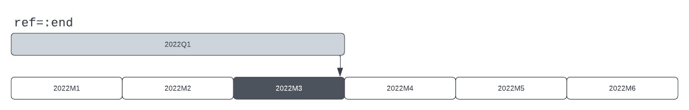

**Example 2: conversion to a lower frequency**
```
fconvert(Quarterly, 2022M3) # 2022Q1
```
Because the last day of 2022M3 is March 31st, 2022, and because that day lands in the days covered by 2022Q1, the output MIT is 2022Q1.
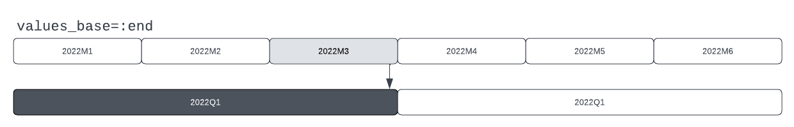

### Options: `values_base`
The previous two example do not specify the `values_base` argument which defaults to `:end`. When `values_base = :true` is employed, the comparison is between the first date in the input MIT and the days covered by the output MITs. 

**Example 3: conversion to a higher frequency, values_base = :begin**
```
fconvert(Monthly, 2022Q1, values_base=:begin) # 2022M1
```
Because the first day of 2022Q1 is January 1st, 2022, and because that day lands in the days covered by 2022M1, the output MIT is 2022M1.
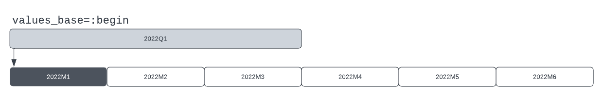


**Example 4: conversion to a lower frequency, values_base = :begin**
```
fconvert(Quarterly, 2022M3, values_base=:begin) # 2022Q1
```
Because the first day of 2022M3 is March 1st, 2022, and because that day lands in the days covered by 2022Q1, the output MIT is 2022Q1.
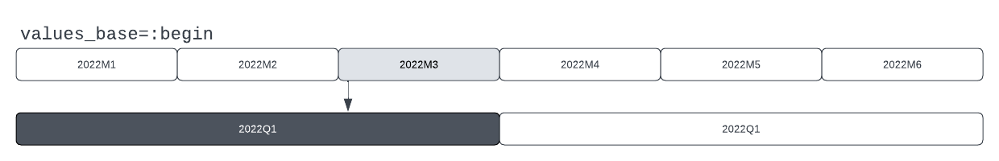


## Converting MIT ranges
When converting an MIT range between frequencies, the first day in the first MIT in the input range is aligned with an MIT in the output range, as is the last day in the last MIT in the input range.

**Example 1: conversion of an MIT range**
```
fconvert(Monthly, 2022Q2:2022Q3) # 2022M4:2022M9
```
In this example, the start and end of the input frequencies align well with the start and end of the output frequency. The first day of 2022Q2 is April 1st, 2022, which is included in the days covered by 2022M4, this is therefore the first MIT in the output frequency.

The last day in 2022Q3 is September 30th, 2022, which is included in the days covered by 2022M9, this is therefore the last MIT in the output frequency.


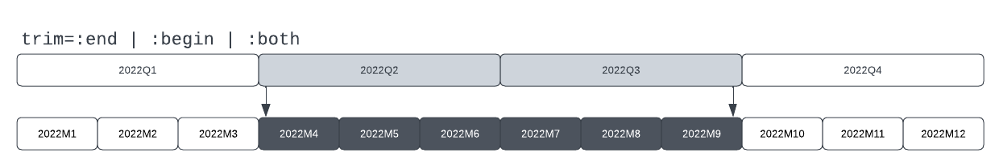


### Options: `trim`
The `trim` option determines which MITs are included in the output range whenever the beginning and/or end of the input range does not perfectly align with the beginning/end MITs in the output range.

When `trim = :end` the last mapped MIT in the output range will be removed whenever the last day in said MIT does not align with the last day in the last MIT of the input range.

When `trim = :begin` the first mapped MIT in the output range will be removed whenever the first day of said MIT does not align with the first day in the first MIT of the input range.

When `trim = :both`, both rules are applied. This is the *default behavior*.

---

**Example 2: trim = :end**
```
fconvert(Quarterly, 2022M3:2022M10, trim=:end) # 2022Q1:2022Q3
```
In this example, the last day of 2022M10 is October 31st, 2022. This is included in the days covered by 2022Q4. However, since the last day of 2022Q4 is December 31st, 2022 (i.e. different from October 31st, 2022), this MIT is dropped from the output range. The last MIT in the output range is therefore 2022Q4.

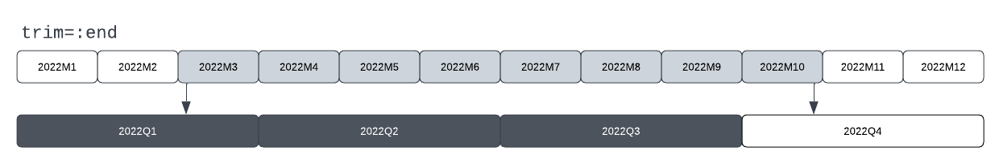

Missalignment at the start of the range is ignored in this case.

---

**Example 3: trim = :begin**
```
fconvert(Quarterly, 2022M3:2022M10, trim=:begin) # 2022Q2:2022Q4
```
In this example, the first day of 2022M3 is March 1st, 2022. This is included in the days covered by 2022Q1. However, since the first day of 2022Q1 is January 1st, 2022 (i.e. different from March 1st, 2022), this MIT is dropped from the output range. The firt MIT in the output range is therefore 2022Q2.

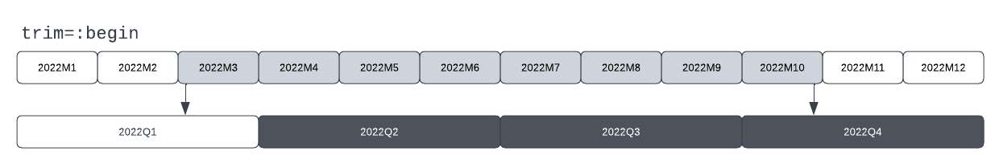

Missalignment at the end of the range is ignored in this case.

---

**Example 4: trim = :both**
```
fconvert(Quarterly, 2022M3:2022M10, trim=:both) # 2022Q2:2022Q3
```
In this example, both ends do not align perfectly with any output MITs. The first day in the first MIT of the input range comes after the first day of the matched output MIT, and the last day of the last MIT in the input range comes before the last dat of the matched output MIT so both the first and last MIT in the output range are excluded.

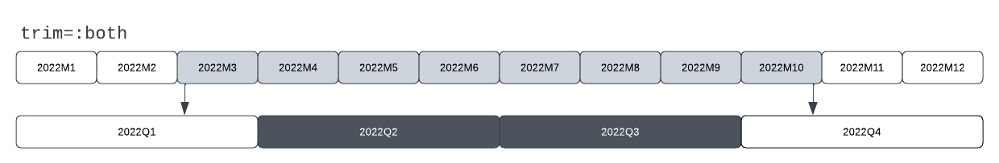

---


## Converting TSeries to a higher frequency

Conversion of a TSeries to a higher frequency proceeds in two stages.

1. Each MIT in the input range is mapped onto the last day in MITs in the output frequency. If `values_base = :begin` they are mapped onto the first day in the output MITs. 
2. The values in the output MIT are assigned based on the conversion method. 

Note that the output range is similar to a conversion of the input range with `trim` set to the value of the `values_base` argument.

Two conversion methods are available: `:const` and `:even`. 

* `:const` applies the values of the input MITs to each mapped MIT in the output range.
* `:even` divides the value in the input MITs evenly between mapped MITs in the output range.

The default is `:const`. The default `values_base` is `:end`.

---

**Example 1: `method=:const`**
```
ts = TSeries(2022Q2, collect(2.0:3.0))
fconvert(Monthly, ts)
```
In this example, each month in 2022Q2 is given the value 2.0, and each month in 2022Q3 is given the value 3.0.
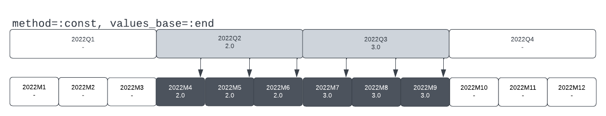

---

**Example 2: `method=:const`, `values_base=:end`**
```
ts = TSeries(2023Y{11}, collect(2.0:3.0))
fconvert(Quarterly, ts, values_base=:end)
```
This example uses a Yearly TSeries with an end-month in November, Thus, the first MIT in the input TSeries spans December 1st, 2022, until November 30th, 2022. There is therefore a value which can be mapped onto December 31st, 2022, the last day of 2022Q4, and thus there is a value assigned for 2022Q4.

The value assigned to 2023Q4 comes from the second year of data as that year starts December 1st, 2023.

There is no value assigned to 2024Q4 as the last day in that quarter comes after the end of our data.

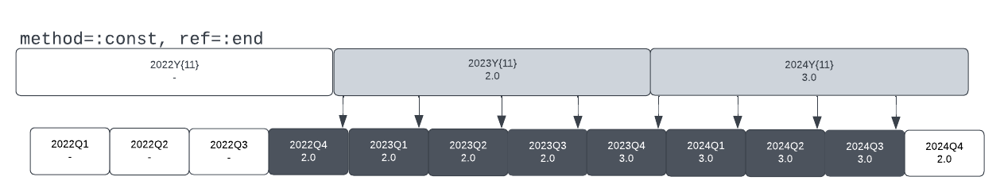

---

**Example 3: `method=:const`, `values_base=:begin`**
```
ts = TSeries(2023Y{11}, collect(2.0:3.0))
fconvert(Quarterly, ts, values_base=:begin)
```
This is similar to the previous example. However, in this case the input values are mapped onto the first day in the output MITs. As a result, the output coveres a different range, but each of the input values is still mapped onto four quarters.

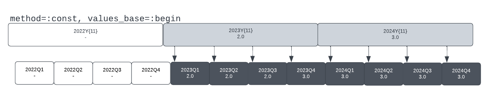

---

**Example 4: `method=:even`, `values_base=:end`**
```
ts = TSeries(2022Q2, collect(2.0:3.0))
fconvert(Monthly, ts, method=:even)
```
The days covered by 2022Q2 include the end-days of three months, 2022M4, 2022M5, and 2022M6. The value for this quarter is therefore divided by three and applied to these months. The procedure for 2022Q4 is similar.

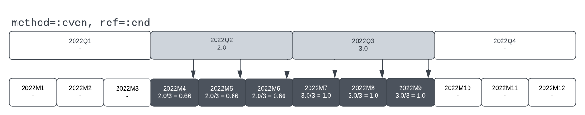

If we had specified `values_base=:begin`, we would have checked against the start day of each Monthly MIT, but in this case the outcome would have been the same.

## Converting TSeries to a lower or equal frequency
Conversion of TSeries to a lower or equal frequency depends on the `method` and `values_base` chosen, with the main differences arriving between the `:point` method and the other methods.

### **On or before** principle with `method = :point` 
When the conversion method is `:point` the output series will contain the latest input values whose start/end dates fall **on or before** the start/end date of each output MIT, depending on the value of `values_base`.

With this method, it is only necessary to determine which single value from the input tseries corresponds to each period of the output tseries. When values_base is `:end` the values for both the input and the output series are assumed to be recorded on the last day of each MIT, and the approach is to determine whether a valid value in the input series corresponds to the last day in the output MITs. On the other hand,when values_base is `:begin`, the values for both the input and output series are assumed to be recorded on the first day of each MIT and the approach is similarly to determine whether a valid value in the input series corresponds to the first day in the output MITs. The following goes into  more detail.

When the method is `:point` and the values_base is `:end` each value in the input TSeries is ascribed to the last date in each MIT in that series. The last value which comes *on or before* the last date in each output period is then chosen as the value for each output period.

The range of the output period is determined based on the availability of data:
* The first output period is the first period which contains at least one value from the input tseries.
* The last output period is the last period for which there are no missing input values. That is, (1) at least one input value is available, and (2) the last input value is ascribed to a date which is less than one full input period from the last date in the output period.

---

**Example 5: `method=:point`, `values_base=:end` (1)**
```
ts = TSeries(2022M3, collect(3.0:10.0))
fconvert(Quarterly, ts, method=:point, values_base=:end)
```
In this example, the output series has a value for 2022Q1 because there is an input value for that period on March 31st, 2022, which comes on or before the last day of 2022Q1. There is no value for 2022Q4 because there is are one or more full input periods which would have provided data in Q4, but for which there are no input values.

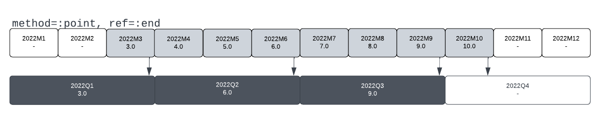

Visually, the value for each output period is taken from the last input MIT whose last day is within the output MIT. This is better illustrated by the next example.

--- 

**Example 6: `method=:point`, `values_base=:end` (2)**
```
ts = TSeries(2022Q3{2}, collect(3.0:10.0))
fconvert(Yearly, ts, method=:point, values_base=:end)
```
As mentioned in the example above, the value for each output period is taken from the last input MIT whose last day falls within each output MIT. Thus, the value for 2022Y comes from 2022Q4{2}, whose last day is November 31st, 2022. The value for 2023Y similarly comes from 2023Q4{3{2}. There is no value for 2025Y as there are one or more full input periods corresponding to 2024Y which do not have a value in the input series.

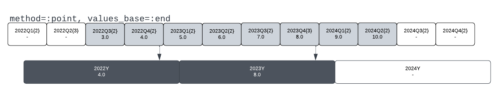

---

When the method is `:point` and the values_base is `:begin` the approach from above is mirrored. Each value in the input TSeries is ascribed to the first date in each MIT in that series. The last value which comes *on of before* the first date in each output period is then chosen as the value for each output period.

The range of the output period is again determined based on the availability of data:
* The first output period is the first period for which there are no missing input values. In essence it requires a value from an input period whose first date is on or before the first date of the output period.
* The last output period is the last period for which there is an input period with a start-date on or before the start-date of the output period.

--- 

**Example 7: `method=:point`, `values_base=:begin` (1)**
```
ts = TSeries(2022M3, collect(3.0:10.0))
fconvert(Quarterly, ts, method=:point, values_base=:begin)
```
In this example, the output series has no value for 2022Q1 as there is no input value which is recorded on or before Jan 1st, 2022. There is an output a value for 2022Q4 as the input value from 2022M10 is recorded on of before the first day of 2022Q4, i.e. October 1st, 2022.

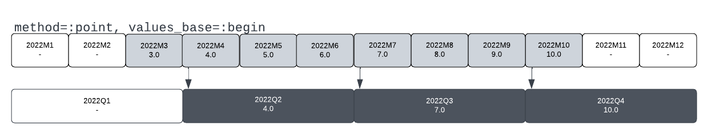

Visually, the value for each output period is taken from the input MIT which covers the start-date of the output MIT. This is better illustrated by the next example.

---

**Example 8: `method=:point`, `values_base=:begin` (2)**
```
ts = TSeries(2022M3, collect(3.0:10.0))
fconvert(Quarterly, ts, method=:point, values_base=:begin)
```
As mentioned in the example above, the value for each output period is taken from the input period which overlaps the first day of each output period. Thus, the value for 2023Y comes from 2023Q1{2} and the value from 2024Y comes from 2024Q1{2}. There is no value for 2022Y as there is no input period covering January 1st, 2022.

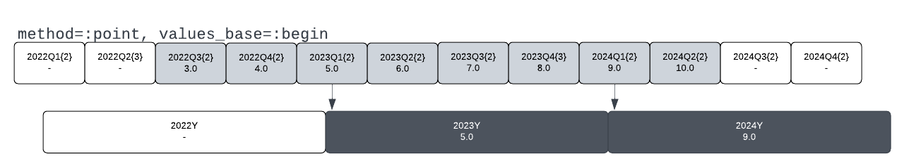

---

### **Within** principle with `method = :mean | :sum | :max | :min` 
When the conversion method is `method = :mean | :sum | :max | :min` the output series will contain values corresponding to some transformation of the collection of input values whoes start/end dates fall **within** each output MIT, depending on the value of `values_base`.

The approach is similar to the the `:point` method but with some nuance around the assignment of imput-period values to output periods and the requirements around the inclusion of output periods.

Specifically:
* Input period values are assigned to each output period covering the start or end date of each input period, depending on the `values_base` argument. 
* Output periods are included if there is a value available for all the input periods with start/end dates covered by the output period.

Thus, these methods require that each output period is entirely covered by input values. By contrast, the `:point` method makes allowances for values at the start/end of the output range, depending on the `values_base` argument.

Furthermore, these methods only assign values to output periods from input periods which directly align with output periods. By contrast, the `:point` method, particularly with `values_base=:begin`, will assign values to an output period which were recorded before the start of said output period.

Once the values corresponding to the output period have been determined, a caluclation is made based upon the method chosen:

* `:mean` -  The values are summed and divided by the number of input values.
* `:sum` - The values are summed.
* `:min` - The lowest value is selected from among the input values.
* `:max` - The highest value is selected from among the input values.

The default is `:mean`. The default `values_base` is `:end`.

---

**Example 9: `method=:mean`, `values_base=:end` (1)**
```
ts = TSeries(2022M3, collect(3.0:10.0))
fconvert(Quarterly, ts, method=:mean, values_base=:end)
```
In this example, the months of April, May, and June, 2022, feed into 2022Q2 and the output series has a value for 2022Q1 because there is an input value for that period on March 31st, 2022, which comes on or before the last day of 2022Q1. There is no value for 2022Q4 because there is are one or more full input periods which would have provided data in Q4, but for which there are no input values.

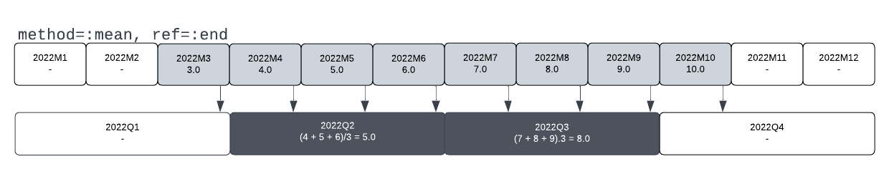

In this case, becasue the months and quarters align perfectly, the result would be the same if `values_base=:begin` had been provided.

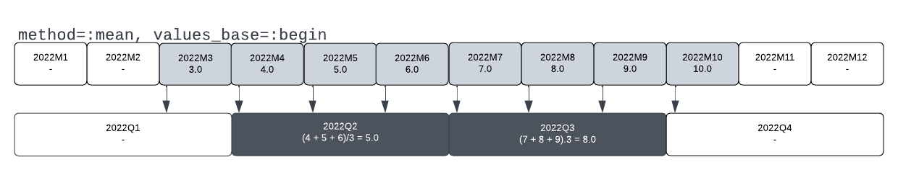

--- 
**Example 10: `method=:mean`, `values_base=:end` (2)**
```
ts = TSeries(2022Q2, collect(2.0:11.0))
fconvert(Yearly{11}, ts, method=:mean, values_base=:end)
```
In this example, the end of 2022Q4 falls within 2023Y{11} (which spans from December 2022 to November 2023). The value for 2023Y{11} is therefore (4+5+6+7)/4 = 5.5. A similar logic applies to 2024Y{11}. There is no value for 2022Y{11} as there are one or more input quarters missing whose end dates fall within 2022Y{11}. In this particular case, both 2021Q4 and 2022Q1 are missing.

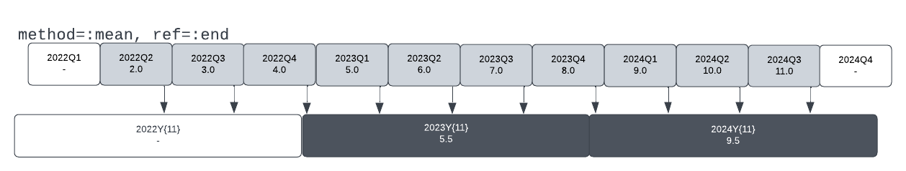

--- 

**Example 11: `method=:mean`, `values_base=:begin`**
```
ts = TSeries(2022Q2, collect(2.0:11.0))
fconvert(Yearly{11}, ts, method=:mean, values_base=:begin)
```
In this example, the start of 2023Q1 falls within 2023Y{11} as do the starts of the following three quarters, the values for 2023Y{11} is therefore (5+6+7+8)/4 = 6.5. Note that this is higher than the value for this output period in the previous example. There is no output value for 2022Y{11} as there are one or more input periods missing whose start-dates overlap with this period, in this case, only 2022Q1. Similarly, there is no output value for 2024Y{11} as there are one or more input quarters missing whose start-dates overlap with this period. In this case, only 2024Q4.

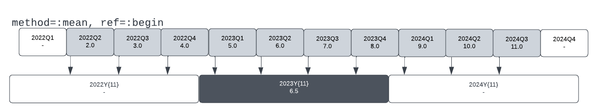

--- 

## TimeSeriesEcon vs FAME
Much of the behavior of time series conversions is implemented to mirror conversions performed with the FAME (Forecasting Analysis and Modeling Environment) software. The conversions of TSeries correspond in large part to the following table.

| TSE method | TSE values_base | FAME technique | FAME observed |
|------------|-----------------|----------------|---------------|
| :mean      | :end/:begin*    | discrete       | averaged      |
| :min       | :end/:begin*    | discrete       | low           |
| :max       | :end/:begin*    | discrete       | high          |
| :sum       | :end/:begin*    | discrete       | summed        |
| :const     | :end            | constant       | end           |
| :const     | :begin**        | constant       | beginning     |
| :even      | :end            | discrete       | summed        |
| :even      | :begin          | N/A            | N/A           |
| :point     | :end            | discrete       | end           |
| :point     | :begin          | discrete       | beginning     |

*When `values_base=:begin` achieving the FAME equvalent requires first converting the input series to a daily series using `convert(ts, daily, discrete, beginning)` with `ignore off`.

**Achieving the FAME equvalent requires first converting the input series to a daily series using `convert(ts, daily, constant, beginning)`  with `ignore off`.

For conversions using `values_base=:begin` the range of the FAME series may be longer than the range of the TimeSeriesEcon series due to the effect of the `ignore` option.

## Converting a TSeries with the `:linear` method

under construnction...


